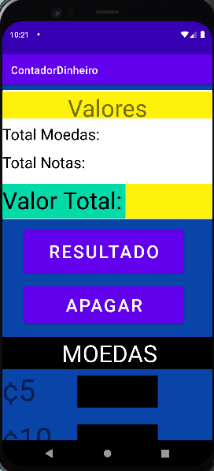
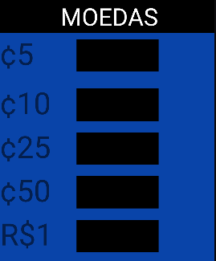
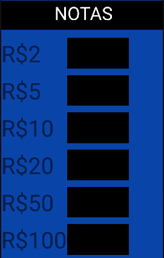

# Contador de Notas e Moedas Mobille - Aplicativo de Treino Mobille

## Necessidade do Projeto

O projeto visa atender à necessidade de uma contagem rápida e eficiente de moedas e notas, proporcionando a separação do valor total de moedas e de notas, além de somar ambos para obter o resultado total do dinheiro inserido.

## Recomendações

### Emuladores Preferenciais

- Android Pixel 5
  - Versão do Android: 5.1
  - Resolução: 1080 x 2280
- Android Pixel 4
  - Versão do Android: 9.0
  - Resolução: 1080 x 2340

## Tecnologias Utilizadas

### Programação

- Java

### Marcação

- XML

## Imagens do Programa

### Programa em Tela Única

*Figura*: Tela única do programa separada em diversas etapas
